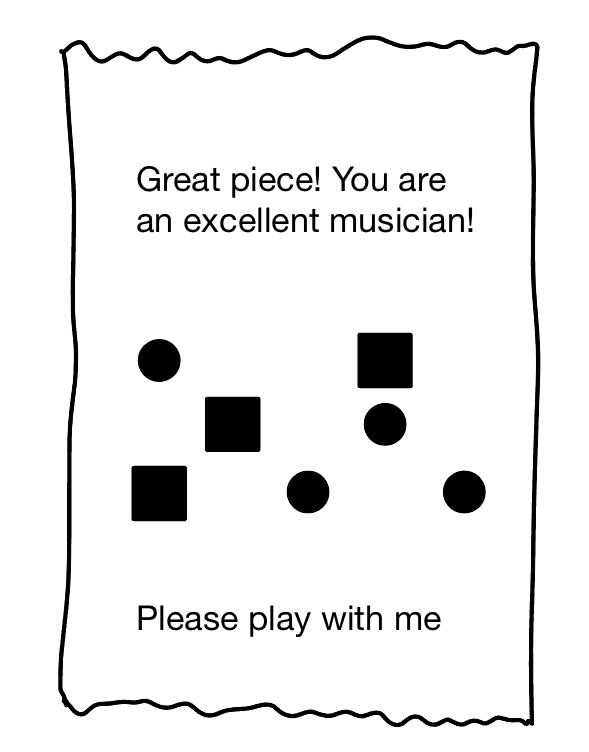

# Final Project
## Milestone 1: Project Ideas

This week, I generated 3 ideas for my final project development. 

### Idea 1: Friendly Printer
The inspiration for this project comes from two memes I found online: 

| Meme 1      | Meme 2 |
| ----------- | ----------- |
|       |       |
| The flower says "Please be my friend. "   | The flower says "Please chat with me. "        |

I somehow resonate with the flowers in the memes. I always want to make new friends and chat with people, but I can be very introverted sometimes and don't know how to start a conversation. Therefore, I am wondering if a machine can act as a medium to have a conversation with even a stranger I've never met before. Below is my ideation of the project. 

I plan to use a receipt printer because the machine and the receipt paper are relatively cheap and easy to buy. The process of receipt printing is also interesting to watch. 

During the conversation, the printer appears very talkative, while the player can only choose from two responses: positive or negative. This is also an interesting reversal between human and machine, as human usually has more flexible and complex language system than machine. 

A conversation will end after several lines. I will further design the visuals during the conversation but here is a very simple one to illustrate the idea. Upon each response, the corresponding area on the screen will grow in size. However, the two colors get more and more similar to each other. When the screen is purely in one color, the machine will say goodbye to the player and tell the player: "You are the No. XX friend I've met today. Thank you so much for accompanying me. Have a nice day..."

Players can tear the receipt away at the end of a conversation. 

In this project, p5.js can handle the visuals on the screen, while the receipt printer and the two buttons can be controlled by Arduino. Serial communication between Arduino and p5.js is needed. [This tutorial](https://blog.arduino.cc/2023/05/20/control-a-thermal-printer-with-your-arduino/) seems very helpful for me to control a thermal printer using an Arduino. 

### Idea 2: Rhythm at Fingertips

This project is inspired by [this video](https://www.youtube.com/watch?v=BboivOblV-A). Below is a sketch of my idea. 

The project invites people to create music by making their fingertips touch. To track hands, we just need a webcam and ml5.js library. The visuals on the screen and music can be handled by p5.js. While the music is being generated, an LED matrix controlled by an Arduino board will function as a physical visualization of music. 

The logic of this project should be simple and I've done similar things in my previous project. I think the main challenge would be how to make the music visualization attractive and replayable. 

### Idea 3: Weather Board

As the weather is getting cold in New York and the temperature difference within a day can be up to 10 celsius degrees, I always need to check on my phone so I know what to wear before going out. Therefore, I want to make a real-time weather data visualization interface that is more intuitive to view and interact with. 

When a person gets close to the interface, it will light up and show weather information. This can be achieved by a sensor controlled by an Arduino board. The interface will recognize my gesture of swiping left or right to show me the past or future temperature. This can be achieved by ml5.js library. As for fetching and processing the real-time weather data, I found tutorials like [this one](https://www.youtube.com/watch?v=PhDPnjF3_tA) helpful. 

The Weather APP on iPhones can be a good reference for what information to include in my Weather Board. 

## Milestone 2: Project Proposal, Planning and Organizing

This week, I further developed the Friendly Printer idea. However, I renamed it to Music Printer and designed it to collaborate with the player to create a music piece. By controlling a potentiometer and two buttons, the player can write music notes. The installation will also randomly generate notes so that the result is a human-machine collaboration. 

The notes will be displayed in two forms: as geometric shapes on the screen and printed out via a thermal printer.

### Discussions about the project idea

The Music Printer is an installation that invites people to collaborate with machines. This human-machine cooperation is important to me as many of my projects cannot come true without machines, algorithms, AI, etc. Moreover, this installation also carries my self-expression. I like music, chatting, meeting new friends, and bringing joy to others, which are what the installation will do when interacting with players. It is like a medium for me to meet people and play music with them. 

The installation is also related to our society nowadays. Heated discussions happened around the authenticity of AI-generated artwork, while more and more industries are leveraging the power of AI. Although my project is not likely to integrate AI tools due to limited time, I hope the machine-human collaboration mode for music creation is just as thought-provoking. By introducing the thermal printer into the installation, I also try to humanize machines: they are not just cold tools, but can also be our cooperators in everyday tasks or a playmate when killing time. Machines are indeed becoming part of our modern lives. 

The installation can also be related to our previous readings. Douglas Rushkoff may see the installation as a modeled reality because I will use MIDI music to produce chords. Chris Crawford might think of the installation as interactive but not highly interactive. I think the Music Printer will not be "thinking" -- it will just "listen" and "speak" in the language it can understand. On the other hand, players as humans will "listen to" and think about the information provided, and "speak" to the machine in terms of actions. 

### System Diagram

### FSM Diagram

### Circuit Diagram

### External Data / Libraries

So far I don't see the need for external data, but I will use the external libraries below: 

#### p5.js libraries
* p5.sound library for MIDI notes playing. 
* ml5.js library for face detection and face landmark drawing. 
* p5.Polar for creating beautiful polar backgrounds, which can also be interactive. 

#### Arduino libraries
* ArduinoJson library for serial communication between p5.js and Arduino. 
* Adafruit Thermal Printer library for thermal printer control.

### Input and Output
* Devices/components for input: webcam * 1, potentiometer * 1, button * 2
* Devices/components for output: monitor * 1, thermal printer * 1

I was planning to use an ultrasonic sensor for player detection around the installation, but it only works with 5V power (the highest power available from Arduino Nano ESP32 is 3.3V). Therefore, currently I don't plan to use sensors in my project. 

### Project planning & progress

Since I went to CMU for the "art && code" workshop at CMU last weekend, I didn't get much time to work on the coding of the Music Printer. However, I have bought a thermal printer, a suitable AC-to-DC converter for powering the printer, and thermal paper for printing. I also have achieved serial communication between p5.js and Arduino by working on [HW12](https://github.com/6063-fuguoxue/HW12). Below is my plan for the upcoming week: 

| Deadline      | Task |
| ----------- | ----------- |
| 12/10/2023 | Finish the logic in p5.js |
| 12/13/2023 | Finish thermal printer testing |

If I can finish the tasks above, I should be able to do user testing and project iterations by 12/20/2023, our presentation date. 

#### Back-up plans
I have spent a lot of time this week trying to integrate Hydra into p5.js sketch but failed. If I have enough time later, I will try again on that. Otherwise, p5.Polar seems a good option, too. 

If I cannot work out the thermal printer, I will focus on refining the music logic and the digital effects on the screen. 

### References and Resource
**Face API**: 
* https://editor.p5js.org/rios/sketches/QH1ch5GFr

**Thermal printer tutorial**: 
* https://blog.arduino.cc/2023/05/20/control-a-thermal-printer-with-your-arduino/

**Artwork using thermal printer**: 
* https://vimeo.com/33698229
* https://hackaday.com/2020/10/03/receipt-printers-end-it-all-in-moving-art-piece/

**Interactive Hydra coding pieces (coded by myself)**: 
* [Flowers](https://hydra.ojack.xyz/?showCode=false&code=JTJGJTJGJTIwZ3JhZGllbnQlMjBzZXF1ZW5jZSUyMGF0JTIwc3BlZWRzJTIwb2YlMjAxJTJDJTIwMiUyMCUyNiUyMDQlMEElMEFzMC5pbml0Q2FtKCklMEFzcmMoczApLnBpeGVsYXRlKDIwJTJDMjApLmthbGVpZCgxMCkuY29sb3IoMSUyQyUyMDElMkMlMjAwLjgpLnJlcGVhdCgpLm91dCgpJTBBcmVuZGVyKG8wKQ%3D%3D)
* [Geometry](https://hydra.ojack.xyz/?showCode=false&code=JTBBczAuaW5pdENhbSgpJTBBJTBBc3JjKHMwKS5waXhlbGF0ZSgxKS5jb2xvcigwLjglMkMlMjAwJTJDJTIwMC44KS5yb3RhdGUoMSUyQyUyMDAuMSkucmVwZWF0KCkub3V0KG8wKSUwQSUwQXZvcm9ub2koNSUyQzAuMyUyQzAuMykudGhyZXNoKDAuNSUyQzAuMDQpLm91dChvMSklMEFzcmMobzApLmRpZmYobzElMkMlMjAyKS5vdXQobzIpJTBBJTBBcmVuZGVyKG8yKSUwQSUwQQ%3D%3D)
* [Lake Surface](https://hydra.ojack.xyz/?showCode=false&code=JTBBczAuaW5pdENhbSgwKSUwQSUwQXNyYyhzMCkub3V0KG8wKSUwQSUwQW9zYygzMCkua2FsZWlkKCkucGl4ZWxhdGUoKS5vdXQobzEpJTBBJTBBc3JjKG8wKS5tb2R1bGF0ZShvMSUyQyUyMDAuMSkub3V0KG8yKSUwQSUwQXJlbmRlcihvMiklMEElMEE%3D)
* [Artificial Desert](https://hydra.ojack.xyz/?showCode=false&code=JTBBJTIwJTBBczAuaW5pdENhbSgpJTBBJTBBc3JjKHMwKS5ibGVuZChvMCUyQyUyMDAuOTYpJTBBLmNvbnRyYXN0KDEuMDIpJTBBLnNhdHVyYXRlKDEuMDIpJTBBJTJGJTJGJTIwLnNjYWxlKDEuMDEpJTBBLm1vZHVsYXRlKG8wJTJDJTIwMC4wMDYpJTBBLm91dChvMCklMEElMEFyZW5kZXIobzAp)

**How to use Hydra in p5.js project**: 

* https://editor.p5js.org/ffd8/sketches/1_Nk1IPF4

* https://editor.p5js.org/micuat/sketches/jy5R67ntn

* https://www.npmjs.com/package/hydra-synth

## Milestone 3: Project Development

This week, I developed my Music Printer installation as a music game and tested my thermal printer. I made some changes to the project diagrams and finished the demo of my project. 

To briefly introduce my project demo, it is inspired by [Bach: Prelude 1 in C Major BWV 846](https://www.youtube.com/watch?v=PXMVkQ70I88). Upon the game's start, the player can use the potentiometer and button 1 to tweak the five music notes on the screen, which will later be played in the loop of 1-2-3-4-5-3-4-5. After setting the initial set of notes, the player can press button 2 to start playing the loop music. The player can also change the notes while the music is playing. After a preset length of time, the game ends and invites the player to restart the game. 

The thermal printer logic will be developed in the upcoming week. 

### Updated Diagrams

### Videos

#### Project Demo

      

#### Thermal Printer Testing

      

### Next Steps

This week in class, I want to have classmates playtest the Music Printer. I also want to gather some feedback for future improvement. 

For next week, I will refine the visuals based on the feedback and get the thermal printer working along with p5.js. 

## Milestone 4: Final Code, Documentation and Video
### System diagram

### FSM diagram

### Circuit diagram

### Description of any external data or library
The final version of this project utilized ml5.js and p5.sound libraries. ml5.js is for face recognition at the beginning of the game, and p5.sound is for the chords playing. 

### Description of sensor, output component, and mechanism
The physical components involved are two buttons, one potentiometer, and one thermal printer. 
Potentiometer: change note at the current selected slot;
Button 1: switch to the next spot;
Button 2: start playing the chords;
Thermal Printer: print visualization of the chords.

### Reference images, texts, and projects
**Face API**: 
* https://editor.p5js.org/rios/sketches/QH1ch5GFr

**Thermal printer tutorial**: 
* https://blog.arduino.cc/2023/05/20/control-a-thermal-printer-with-your-arduino/

**Artwork using thermal printer**: 
* https://vimeo.com/33698229
* https://hackaday.com/2020/10/03/receipt-printers-end-it-all-in-moving-art-piece/

**My Homework 9**: 
* https://github.com/6063-fuguoxue/HW09

**p5.PolySynth**: 
* https://p5js.org/reference/#/p5.PolySynth

**ADSR Envelope - p5.js Sound Tutorial**: 
* https://www.youtube.com/watch?v=wUSva_BnedA&t

**ADSR Envelope - p5.js Sound Tutorial**: 
* https://www.youtube.com/watch?v=wUSva_BnedA&t

### Short discussion of why your project is relevant:
The Music Printer is an installation that invites people to collaborate with machines. This human-machine cooperation is important to me as many of my projects cannot come true without machines, algorithms, AI, etc. Moreover, this installation also carries my self-expression. I like music, chatting, meeting new friends, and bringing joy to others, which are what the installation will do when interacting with players. It is like a medium for me to meet people and play music with them. 

The installation is also related to our society nowadays. Heated discussions happened around the authenticity of AI-generated artwork, while more and more industries are leveraging the power of AI. Although my project is not likely to integrate AI tools due to limited time, I hope the machine-human collaboration mode for music creation is just as thought-provoking. By introducing the thermal printer into the installation, I also try to humanize machines: they are not just cold tools, but can also be our cooperators in everyday tasks or a playmate when killing time. Machines are indeed becoming part of our modern lives. 

The installation can also be related to our previous readings. Douglas Rushkoff may see the installation as a modeled reality because I will use MIDI music to produce chords. Chris Crawford might think of the installation as interactive but not highly interactive. I think the Music Printer will not be "thinking" -- it will just "listen" and "speak" in the language it can understand. On the other hand, players as humans will "listen to" and think about the information provided, and "speak" to the machine in terms of actions. 

### Short discussion of feedback from user testing

Upon Milestone 3, I showed my prototype to people for feedback. Below are some of them: 
* People may not understand the notation system implemented in my project.
* The visuals can be further enhanced.
* Chords may be a good direction to explore. 

Therefore, I made the following changes to the p5.js side: 
* I added changes in the background color at the music composition state. It functions as another reference: for players who don't understand the music notations, they can simply tweak the background to the color they like. 
* I reduced the number of notes available for selection to 3 because 1) I don't want to bother players with too many details of music notations, and 2) I only need one note input to generate a chord.
* I like the music visualization in my homework 9, so I moved it to this final project and modified it.
* I added thermal printing to create more fun in the installation.

Due to limited time, I have more features that I wanted but have yet to implement. For example, now I put all the selected notes as the highest notes in the generated chords so that players can hear more obviously of their selected notes. However, I want to expand the chord list and generate more random chords. Moreover, the current serial communications between Arduino and p5.js tend to lose information and be laggy. I want to find a way to fix that in future iterations. Lastly, I want to make a box to contain my thermal printer, breadboard, Arduino board, and other electronic elements so that they look less messy. 

### Music Printer - Image and Video Demonstration

      

